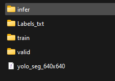
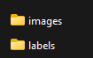

# Cataract Iris Segmentation using SMP

## Setup
Environment is built using `environment.yml`.

The torch home is defined in the models/torch folder to store the downloaded models from PT.

## Configuration

Specify in the "load configuration" block the name of the `.json` file that you want to load. The configuration `.json` file contains the following information:

```json
{
    "NAME": "Unetpp_mobilenetv3_large_100_pretrained",
    "MODE": "train",
    "NUM_EPOCHS": 10,
    "CLASSES": ["pupil"],
    "IN_CH": 3,
    "ARCH": "UnetPlusPlus",
    "ENCODER": "timm-mobilenetv3_large_100",
    "ENCODER_WEIGHTS": "imagenet",
    "LOSS": "DiceLoss",
    "LR": 0.00005
}
```

To load an existing model just need to specify the name:
```
{
    "NAME": "Unetpp_mobilenetv3_large_100_pretrained",
    "MODE": "load"
}
```

### Paths
in the second row specify the name of the `paths.json` to use, this file includese the paths to the data:
```json
{
    "log_path": "logs", # no need to change
    "train_data_root": "G:\\My Drive\\Github\\Cataract_Semantic_Segmentation\\Data\\FSR Dataset\\Yolo_Segmentation_640x640",
    "inference_data_root": "G:\\My Drive\\Github\\Cataract_Semantic_Segmentation\\Data\\FSR Dataset\\Ori_youtube_20",
    "inference_save_path": "G:\\My Drive\\Github\\Cataract_Semantic_Segmentation\\Data\\FSR Dataset\\Ori_youtube_20_infer",
    "checkpoint_path": "C:\\Users\\jonathan\\OneDrive\\MSc in Data Science\\24 Spring\\Healthcare AI\\Final Project\\Model Chekpoints"
}
```

#### Training Data
The `train_data_root` is the root of a folder containing these subfolders:



train - training dataset, with subfolder images and labels.
valid - validation dataset, with subfolder images and labels.



Images generated from the validation dataset will be stored in the `train_data_root\infer\model_name` path.

#### Inference Data
The inference data root can include any folders with images to be run on the models. All the images in the root and subfolders will be used.

Images generated from the inference dataset will be saved to `inference_save_path`.

#### Checkpoint path
Should point to where the model checkpoints are stored.

## Transforms
The `data_transforms_v1` is imported and includes the transformations that I used. To change you need to specify new transfomrations in `models/transforms.py`.

The list of applied trarnsfomrs, by order, is displayed in the notebook.


## Data Loading
Nothing needs to be done, the data is loaded and displayed.

## Model Build
Run all blocks untill "train and plot".
If the mode is "train" this block will train the model and display progress, else nothing will happen.

## Testing
#### Validation Data
The "test on validation data" block will run the model on validation data and plot metrics.

To generate annotated images from the validation dataset run the "generate marked validation" images.

To record the time set `time = True`. The result will be written to file under:
`logs\model_name\test\timing.csv`. Alternatively you can just access the `timings` variable.

#### Inference on new data
Run the first block to generate the dataset. If the images are stereo, set ` is_stereo=True`.

In the next block:
If you want to time the code set `time = True`. If you want to save the images set `save=True`. If you want to display the annotated images set `to_print` to a number of images to display, else set to None.

Images will be stored in the `infer_path\model_name`.